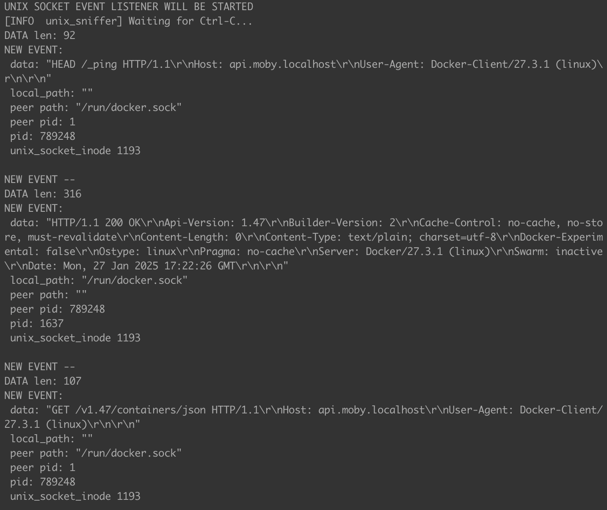
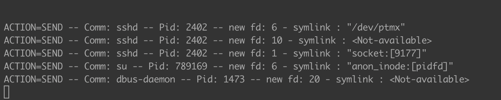
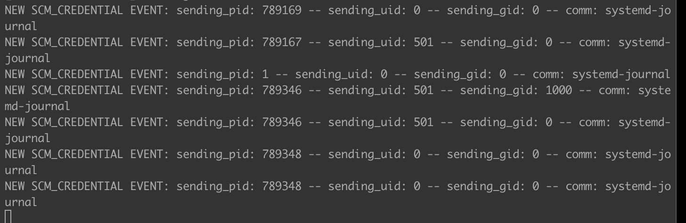

# unix-sniffer

## Prerequisites

1. stable rust toolchains: `rustup toolchain install stable`
1. nightly rust toolchains: `rustup toolchain install nightly --component rust-src`
1. (if cross-compiling) rustup target: `rustup target add ${ARCH}-unknown-linux-musl`
1. (if cross-compiling) LLVM: (e.g.) `brew install llvm` (on macOS)
1. (if cross-compiling) C toolchain: (e.g.) [`brew install filosottile/musl-cross/musl-cross`](https://github.com/FiloSottile/homebrew-musl-cross) (on macOS)
1. bpf-linker: `cargo install bpf-linker` (`--no-default-features` on macOS)

## Build & Run

Use `cargo build`, `cargo check`, etc. as normal. Run your program with:

```shell
cargo run --release --config 'target."cfg(all())".runner="sudo -E" -- (scm-creds|scm-fds|unix-socket)'
```

There are 3 available mods you can choose: `unix-socket`, `scm-fds`, and `scm_creds`.

`unix-socket` : when enabled, allows you to listen to unix socket traffic specified in systemwatchers.

`scm-fds` : allows you to monitor file descriptors passed through unix sockets.

`scm-creds` : allows you to monitor scm_credentials event used as an authentication mechanism between different processes.


Cargo build scripts are used to automatically build the eBPF correctly and include it in the
program.

## Cross-compiling on macOS

Cross compilation should work on both Intel and Apple Silicon Macs.

```shell
CC=${ARCH}-linux-musl-gcc cargo build --package unix-sniffer --release \
  --target=${ARCH}-unknown-linux-musl \
  --config=target.${ARCH}-unknown-linux-musl.linker=\"${ARCH}-linux-musl-gcc\"
```
The cross-compiled program `target/${ARCH}-unknown-linux-musl/release/unix-sniffer` can be
copied to a Linux server or VM and run there.
